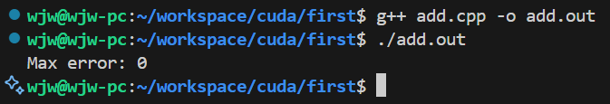
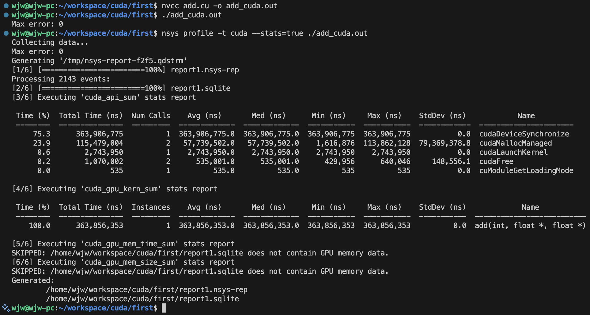
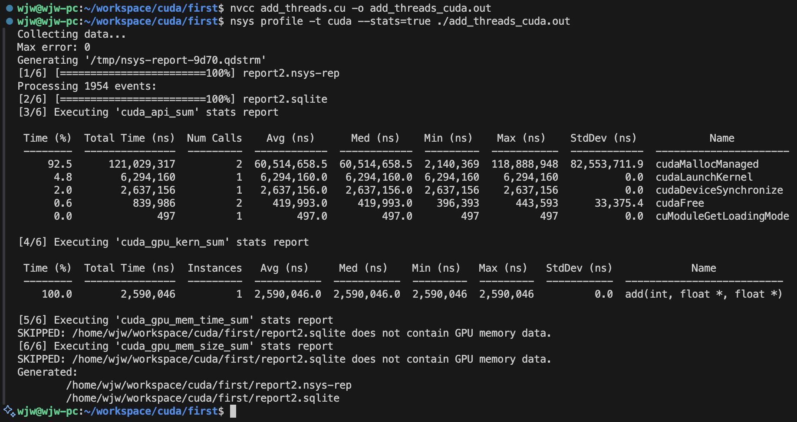

```shell
wjw@wjw-pc:~/workspace/cuda/first$ g++ add.cpp -o add.out
wjw@wjw-pc:~/workspace/cuda/first$ ./add.out
```



```shell
wjw@wjw-pc:~/workspace/cuda/first$ nvcc add.cu -o add_cuda.out
wjw@wjw-pc:~/workspace/cuda/first$ ./add_cuda.out
wjw@wjw-pc:~/workspace/cuda/first$ nsys profile -t cuda --stats=true ./add_cuda.out
```




```shell
wjw@wjw-pc:~/workspace/cuda/first$ nvcc add_threads.cu -o add_threads_cuda.out
wjw@wjw-pc:~/workspace/cuda/first$ nsys profile -t cuda --stats=true ./add_threads_cuda.out
```

